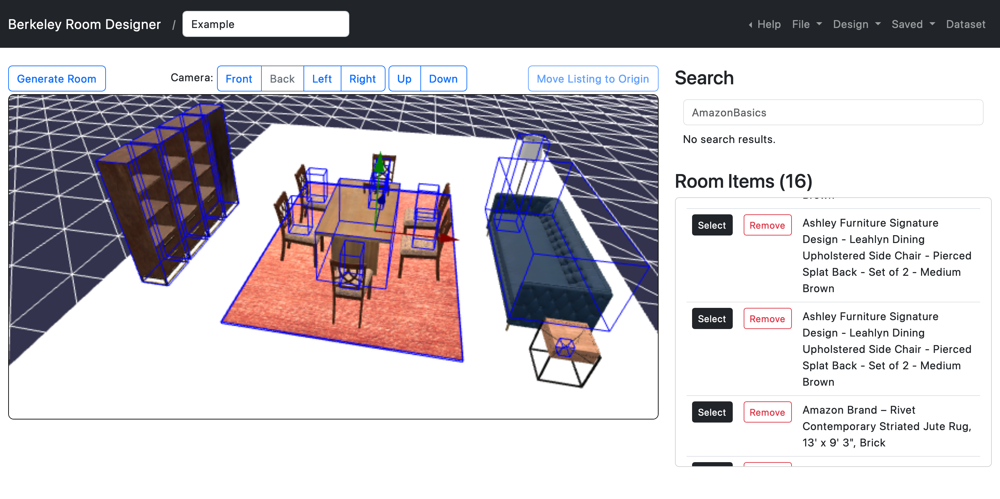
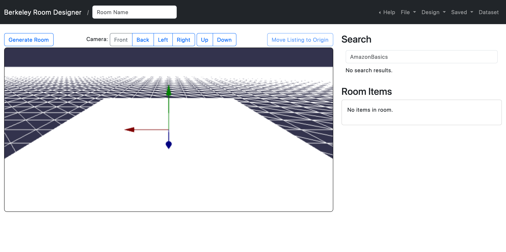
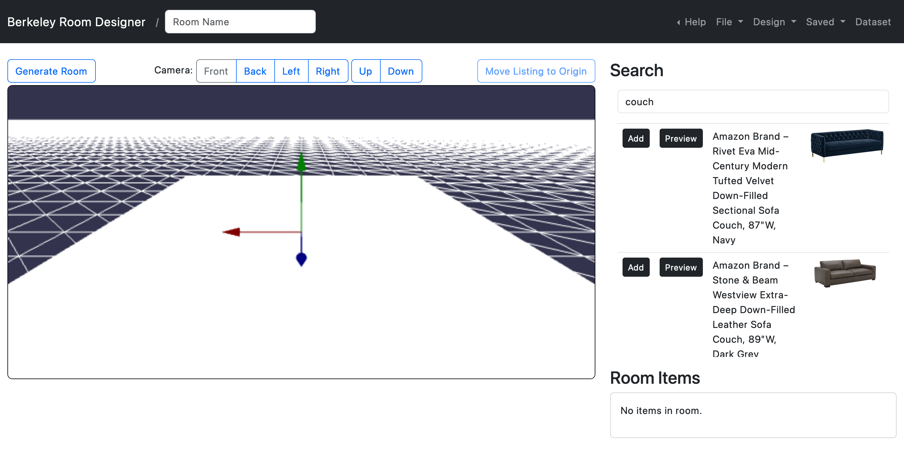
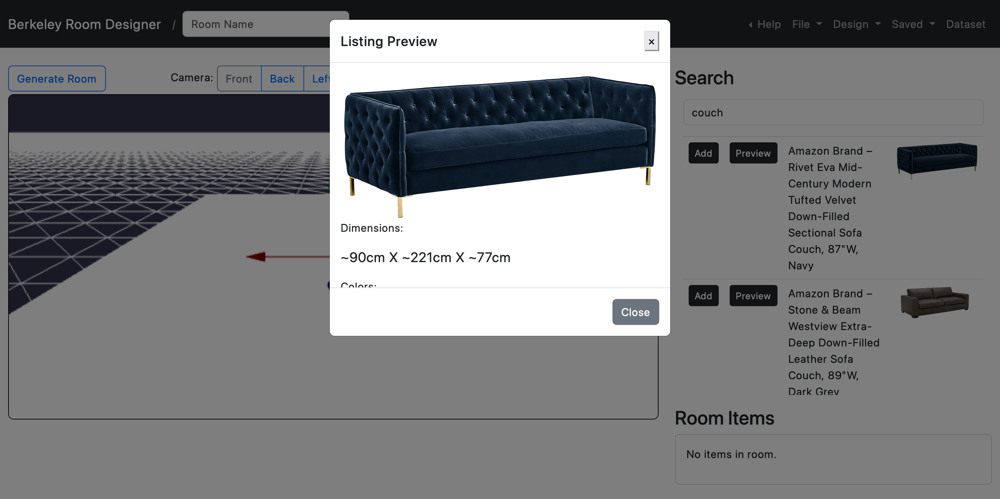
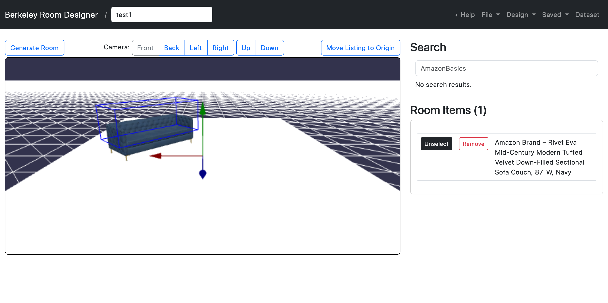
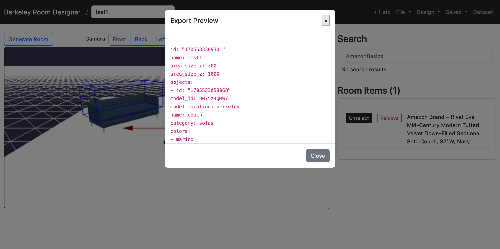
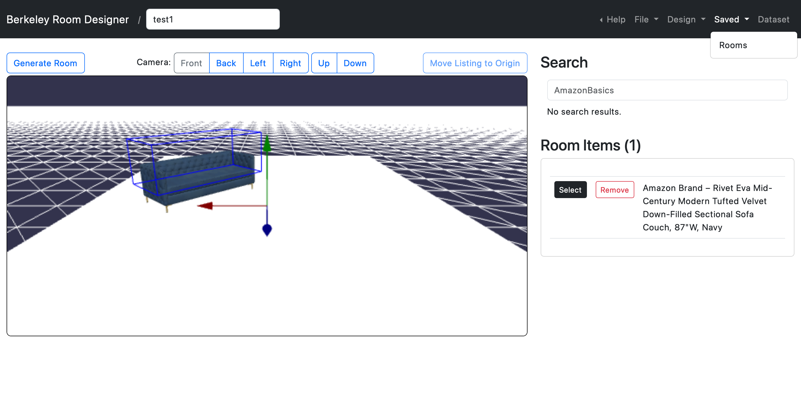
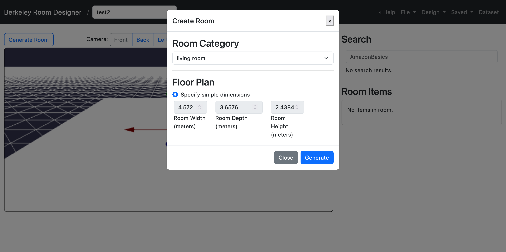
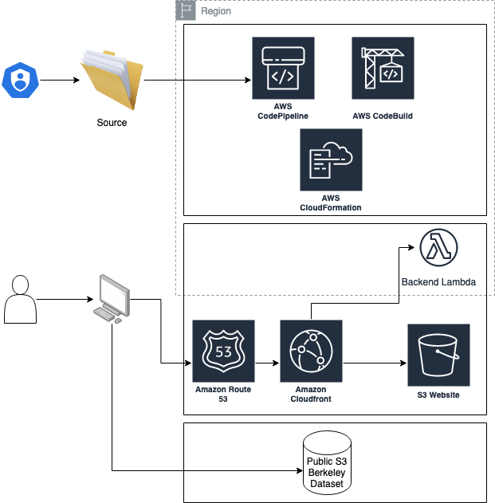

# Berkeley Room Designer
This software provides a (web-based and CLI) room designer which utilizes and collates furnishings from the [Amazon Berkeley dataset](https://amazon-berkeley-objects.s3.amazonaws.com/index.html#aws) and is primarily intended to be a sample for working with it.

----

With this software, you can:
* Generate room configurations in the browser or via CLI using assorted algorithms: prompt-based via LLM, random, autointeriorblog
* Manually create room configurations in 3D - furniture et. al. placed in a room - using listings from the Amazon Berkeley dataset
* Import room configurations - YAML from disk - for editing, or export room configurations - save YAML to disk/browser
* Preview saved room configurations in the browser
* Debug generated room configuration algorithms from the CLI using a desktop GUI

----

## Background
There is lack of annotated floor plan data available that includes furniture (and other room objects) with position and orientation information. The goal of this software is to generate synthetic room configuration data using either a CLI (to generate lots of them) or a GUI (for import, editing, and export) using various furniture placement algorithms, ideally giving the user the ability to choose how deterministic the room configuration output would be. While this software is currently only concerned with furniture, it could be extended to include other room objects (using the Berkeley dataset, even!).

----

## Runtime Pre-Reqs
1. [Firefox](https://www.mozilla.org/en-US/firefox/new/) `115.2.1esr (64-bit)` (Chrome may have issues)

----

## Container Pre-Reqs / Optional
1. [Docker](https://docs.docker.com/get-docker/) `Docker version 20.10.23, build 7155243` (to use a pre-configured development environment to run the frontend/backend in)

----

## Quickstart w/ Containers
You can fast-track yourself and bypass the other steps below by using containers if you just want to run the web application. If you don't want to use containers, continue on down below!

Ensure Docker is running, then, from a terminal, run:

    make -f makefile.docker build/runtime

Once the container images are built, from a terminal, run:

    make -f makefile.docker run/runtime

Enter `http://localhost:8080` into a browser to use the application.

----

## Development Pre-Reqs
1. 'Nix machine (I'm on MacOS (w/ M2), YMMV elsewhere - on Windows the container approach is your best bet)
1. [Node.js](https://nodejs.org/en/download) `20.10.0`
1. [Git](https://git-scm.com/downloads) `git version 2.39.3 (Apple Git-145)` (required by npm to download and install packages from Github, used when `make setup` is invoked)
1. [make](https://www.gnu.org/software/make/) `3.81` (GNU)
1. [cmake](https://cmake.org/) `3.28.1` (required by Node GUI desktop CLI debugger)
1. [curl](https://curl.se/download.html) `8.1.2 (x86_64-apple-darwin22.0) libcurl/8.1.2 (SecureTransport) LibreSSL/3.3.6 zlib/1.2.11 nghttp2/1.51.0` (used for testing)
1. [jq](https://jqlang.github.io/jq/) `1.6` (used for working with JSON in CLI) 
1. unzip `UnZip 6.00 of 20 April 2009, by Info-ZIP.`

> Also, you'll need a way to serve HTTP with support for [range requests](https://developer.mozilla.org/en-US/docs/Web/HTTP/Range_requests). We're using webpack's dev server to do that because we couldn't seem to get http-paged sqlite queries to work otherwise, but if you switch to another, be aware.

----

### Development Pre-Reqs / Optional
If you wish to develop sqlite queries locally, you'll need this sofware installed:
1. [sqlite3](https://www.sqlite.org/index.html)

If you wish to develop furniture placement algorithms using the CLI (with visuals) locally, you'll need this sofware installed:
1. [node-canvas dependencies](https://github.com/Automattic/node-canvas) 

----

### AWS Pre-Reqs / Optional
If you wish to deploy to AWS, you'll need this software installed:
1. [AWS CLI V2](https://docs.aws.amazon.com/cli/latest/userguide/getting-started-install.html) `aws-cli/2.4.0 Python/3.8.8 Darwin/22.6.0 exe/x86_64 prompt/off` and an `~/.aws/credentials` file with active credentials
1. docker `Docker version 20.10.23, build 7155243`

> Currently Docker is **required** to deploy various CDK apps to AWS due to an issue with bundling some (but not all) TypeScript Lambda functions using esbuild, **but only if you do _not_ use CICD to deploy**. If you _do_ use CICD to deploy, Docker is **optional**. See `build/backend` in the makefile for details about the bundling issue.

> The `~/.aws/credentials` file is normally created and configured by the [AWS CLI](https://aws.amazon.com/cli/) and a user, and often updated by single-sign on (SSO) software. The file is required to exist and for the credentials to be active in order to deploy anything, but how it gets there is up to you.

----

## Local Development
From a terminal, run:

    make setup # Only need to do this once.

### Website
#### Website / Develop
To develop the application locally, from a terminal, run:

    make develop/website

This opens up a browser page at `http://localhost:8080` so you can use the application.

> Auto-reload is broken in the webpack config; we're only using webpack's dev server because of its HTTP range request support, which we couldn't get our normal dev server to support even with the same range request middleware! You'll have reload after the "watch" esbuild task finishes bundling, which you can see from the CLI build logs.

#### Website / Run
You can also just "run" the application locally. From a terminal, run:

    make run

This opens up a browser page at `http://localhost:8080` so you can use the application.

----

### Develop / Furniture Placement Algorithms
To develop furniture placement algorithms locally, from a terminal, run:

    make visualizer=true algorithm=random generate-synthetic-room-data # "random" algo.
    make algorithm=random generate-synthetic-room-data # No visualizer. 

    make visualizer=true algorithm=autointeriorblog generate-synthetic-room-data # "autointeriorblog" algo.
    make algorithm=autointeriorblog generate-synthetic-room-data # No visualizer.

    # Make sure you've completed the instructions in the "AWS Setup" section of this README first.
    make visualizer=true algorithm=llm generate-synthetic-room-data # "autointeriorblog" algo.
    make algorithm=llm generate-synthetic-room-data # No visualizer.

> Note: If you see an error related to the ts-matrix package, see `<berkeley-room-designer-root>/src/frontend/furniture-placement/autointeriorblog/vectors.ts` file for how to swap the dependency for Node.

----

## AWS Setup
You can run this application locally with the included dataset subset without deploying to AWS (but you can also deploy this source as a website to AWS). In order to do that - or to enable creating room configurations (furnished rooms) from Amazon Bedrock prompts with an LLM - first configure the `<berkeley-room-designer-root>/config/.env` file with your AWS information for the "main" stage. Edit this information:

    aws_main_cli_profile=mainframenzo-abrd
    aws_main_account_id=012345678901
    aws_main_region=us-west-2
    aws_main_deploy_id=test1
    aws_main_cdk_qualifier=abrdtest1

You'll also need to go into the AWS Console and enable the Claude model for LLM-based room configuration creation to work:

If you do not do this, you will see this error when trying to create a room configuration using an LLM:

> An error occurred (AccessDeniedException) when calling the InvokeModel operation: Your account is not authorized to invoke this API operation.

----

## AWS Deploy
To create the AWS resources necessary to get CICD up and running (via CloudFormation), from a terminal, run:

    make -f makefile.aws deploy/cdk/main
    make -f makefile.aws deploy/cicd/main

To start the CICD process, upload the current source to a bucket in order to start the deployent process. From a terminal, run:

    make -f makefile.aws start/cicd/main

You can go to the deployed website once CICD finishes. From a terminal, run:

    make -f makefile.aws open-website/main

----

## AWS Synth
To validate infra code (to a certain extent), you can "synth" (generate CloudFormation templates from code). Ensure Docker is running, then, from a terminal, run:

    make -f makefile.aws app_location=local cdk_action=synth deploy/from-cicd

----

## AWS Destroy
When you're ready to delete all resources related to a stage's deployment, from a terminal, run:

    make -f makefile.aws destroy/main

> If this command fails, it is OK to run it again.

----

## Dataset
### Dataset / SQLite Database
The `<berkeley-room-designer-root>/build-utils/data/berkeley.db` sqlite database is built and committed to code because it takes a couple minutes to build the berkeley.db file. **Only a subset of the Berkeley dataset is included in this source** because it was too large for our hard drive, and this subset is the data the database is built from. If you decide to update how the dataset is parsed and the `<berkeley-room-designer-root>/build-utils/data/berkeley.db` file needs to be rebuilt, you can do this locally if you have enough space. From a terminal, run:

    make build/dataset-to-sqlite-db

----

## Runbook
### SQLite
If you have sqlite installed locally you can debug the .db file generated from the dataset. From a terminal, run:

    sqlite3
    
    SQLite version 3.43.0 2023-08-24 12:36:59
    Enter ".help" for usage hints.
    Connected to a transient in-memory database.
    Use ".open FILENAME" to reopen on a persistent database.

    sqlite> .open ./build-utils/data/berkeley.db
    sqlite> select * from listings limit 10;

### OpenAPI Definition
You can test that the YAML files in `<berkeley-room-designer-root>/src/backend/openapi-def` are properly defined by running them through the build process. From a terminal, run:

    make build/openapi-def

----

## License Notes
This library is licensed under the MIT-0 License. See the [license.txt](./license.txt) file for more information.

Although this repository is released under the MIT-0 license, an indirect build dependency uses the third party jackspeak@2.3.6 project. The jackspeak@2.3.6 project's licensing includes the BlueOak-1.0.0 license.

Although this repository is released under the MIT-0 license, an indirect build dependency uses the third party path-scurry@1.10.1 project. The path-scurry@1.10.1 project's licensing includes the BlueOak-1.0.0 license.

----

## Security
See [contributing](./readme/contributing.md#security-issue-notifications) for more information.

----

## Code of Conduct
See [code of conduct](./readme/code_of_conduct.md) for more information.